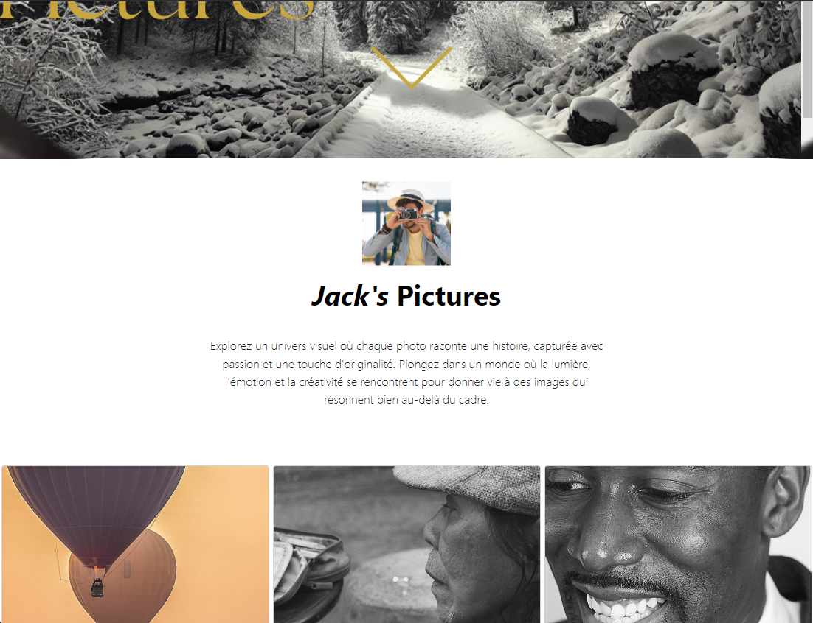

# Site Vitrine Photographe

Ce projet est un site vitrine destiné à présenter le portfolio d'un photographe. Il intègre des effets visuels dynamiques tels que des zooms et des effets parallaxe réalisés en JavaScript, offrant une expérience fluide et immersive pour les visiteurs.



## Fonctionnalités

- **Effet de Zoom** : Le site utilise des effets de zoom pour attirer l'attention sur les images dès le chargement de la page.
- **Effet Parallaxe** : Des effets parallaxe sont implémentés pour ajouter de la profondeur et dynamiser la navigation.
- **Responsive Design** : Le site est optimisé pour une visualisation sur différents appareils, y compris les ordinateurs de bureau, les tablettes et les smartphones.

## Inspiration

Ce projet s'inspire de plusieurs travaux trouvés sur CodePen, où les techniques de parallaxe et de zoom sont explorées pour créer des expériences utilisateur captivantes.

## Auteur

Ce projet a été créé par [Émilie Clain - webOara] en 2024. N'hésitez pas à me contacter pour toute question ou suggestion !

## Captures d'écran


## Installation

1. **Cloner le dépôt** : Pour cloner ce projet, exécutez la commande suivante dans votre terminal :

   ```bash
   git clone https://github.com/mimiecmoua/photograph2.git
   ```
